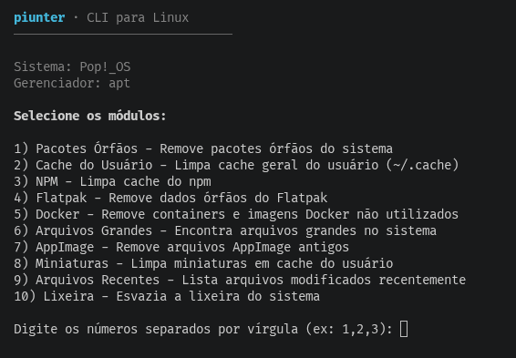

# piunter (v1.3.0)

<pre align="center">

██████╗ ██╗██╗   ██╗███╗   ██╗████████╗███████╗██████╗
██╔══██╗██║██║   ██║████╗  ██║╚══██╔══╝██╔════╝██╔══██╗
█████╔╝██║██║   ██║██╔██╗ ██║   ██║   █████╗  ██████╔╝
██╔═══╝ ██║██║   ██║██║╚██╗██║   ██║   ██╔══╝  ██╔══██╗
██║     ██║╚██████╔╝██║ ╚████║   ██║   ███████╗██║  ██║
╚═╝     ╚═╝ ╚═════╝ ╚═╝  ╚═══╝   ╚═╝   ╚══════╝╚═╝  ╚═╝

</pre>

<p align="center">
  
</p>

CLI para limpeza e otimização de sistemas Linux - Reescrito em Go.

<p align="center">
  
  
  
</p>

## Instalação

### Via binary release

```bash
# Baixe a versão mais recente
curl -L https://github.com/joaomjbraga/piunter/releases/latest/download/piunter-linux-amd64 -o piunter
chmod +x piunter
./piunter --all
```

### Via Go

```bash
go install github.com/joaomjbraga/piunter@latest
```

### Build local

```bash
git clone https://github.com/joaomjbraga/piunter.git
cd piunter/piunter-cli-go
go build -o piunter ./cmd/main.go
./piunter --help
```

## Uso

```bash
# Modo interativo
./piunter

# Limpar tudo
./piunter --all

# Limpar específicos
./piunter --npm --cache --trash

# Analisar sem limpar
./piunter --all --analyze

# Simular (dry-run)
./piunter --all --dry-run

# Lista módulos disponíveis
./piunter --list
```

## Módulos

| Módulo      | Flag            | Descrição                     |
| ----------- | --------------- | ----------------------------- |
| Pacotes     | `--packages`    | Remove pacotes órfãos         |
| NPM         | `--npm`         | Limpa cache do npm            |
| Yarn        | `--yarn`        | Limpa cache do Yarn           |
| PNPM        | `--pnpm`        | Limpa cache do pnpm           |
| Cache       | `--cache`       | Limpa ~/.cache                |
| Flatpak     | `--flatpak`     | Remove dados órfãos           |
| Snap        | `--snap`        | Remove revisões antigas       |
| Docker      | `--docker`      | Remove containers/imagens     |
| Logs        | `--logs`        | Limpa logs do sistema         |
| Large Files | `--large-files` | Encontra arquivos grandes     |
| AppImage    | `--appimage`    | Remove AppImages              |
| Thumbs      | `--thumbs`      | Remove miniaturas             |
| Recent      | `--recent`      | Lista arquivos recentes       |
| Trash       | `--trash`       | Esvazia a lixeira             |

## Flags

| Flag             | Descrição                            |
| ---------------- | ------------------------------------ |
| `--all`          | Executa todos os módulos             |
| `--analyze`      | Analisa sem limpar                   |
| `--dry-run`      | Simula execução                      |
| `--force`        | Pula confirmações                    |
| `--interactive`  | Modo interativo                      |
| `--list`         | Lista módulos disponíveis            |
| `--threshold=MB` | Tamanho mínimo para arquivos grandes |

## Compatibilidade

- Debian/Ubuntu (APT)
- Arch/Manjaro (Pacman)
- Fedora/RHEL (DNF)

## Estrutura do Projeto

O projeto foi reescrito em Go com a seguinte estrutura:

```
piunter-cli-go/
├── cmd/main.go           # Entry point + CLI
├── pkg/types/types.go    # Tipos compartilhados
└── internal/
    ├── core/
    │   ├── analyzer.go   # Análise de espaço
    │   └── cleaner.go    # Limpeza
    ├── modules/
    │   ├── index.go      # Registro de módulos
    │   ├── module.go     # Interface base
    │   ├── cache.go      # Cache usuário
    │   ├── npm.go        # NPM/Yarn/PNPM
    │   ├── packages.go   # Pacotes órfãos
    │   ├── docker.go     # Docker
    │   ├── system.go     # Logs/Flatpak/Snap
    │   ├── files.go      # Large files/AppImage/Thumbs/Recent
    │   └── trash.go      # Lixeira
    └── utils/
        ├── os.go         # Utils SO
        └── logger.go     # Logging
```

## Segurança

- Nunca executa operações sem confirmação (exceto com `--force`)
- Dry-run disponível para testar antes
- Verifica comandos antes de executar
- Tratamento robusto de erros

## Licença

MIT - João Braga

## Contribuindo

Veja [CONTRIBUTING.md](CONTRIBUTING.md)