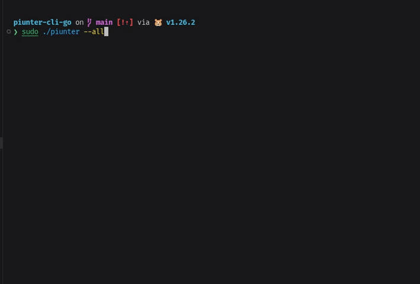

# piunter (v1.4.0)

<div>
  
</div>

CLI para limpeza e otimização de sistemas Linux, escrita em Go.

<p align="center">
  
  
  
  
</p>

## Instalação

### Script de instalação (Recomendado)

```bash
curl -fsSL https://raw.githubusercontent.com/joaomjbraga/piunter/main/install/install.sh | sudo bash
```

Para usuário sem sudo:

```bash
curl -fsSL https://raw.githubusercontent.com/joaomjbraga/piunter/main/install/install.sh | bash
```

### Binary release

```bash
# Baixe a versão mais recente (amd64)
curl -L https://github.com/joaomjbraga/piunter/releases/latest/download/piunter-linux-amd64 -o piunter

chmod +x piunter
sudo mv piunter /usr/local/bin/
piunter --help
```

Para **arm64**:

```bash
curl -L https://github.com/joaomjbraga/piunter/releases/latest/download/piunter-linux-arm64 -o piunter
```

### Via Go

```bash
go install github.com/joaomjbraga/piunter/cmd@latest
```

### Build local

```bash
git clone https://github.com/joaomjbraga/piunter.git
cd piunter
go build -o piunter ./cmd
./piunter --help
```

## Uso

```bash
# Ver help
piunter --help

# Limpar tudo
piunter --all

# Limpar específicos
piunter --npm --nvm --cache --trash

# Analisar sem limpar (ver quanto pode recuperar)
piunter --all --analyze

# Simular execução (não remove nada)
piunter --all --dry-run

# Pular confirmações
piunter --all --force

# Limpar arquivos grandes (threshold customizado)
piunter --large-files --threshold=500
```

## Módulos

| Módulo      | Flag            | Descrição                        |
| ----------- | --------------- | -------------------------------- |
| Pacotes     | `--packages`    | Remove pacotes órfãos            |
| NPM         | `--npm`         | Limpa cache do npm               |
| Yarn        | `--yarn`        | Limpa cache do Yarn              |
| PNPM        | `--pnpm`        | Limpa cache do pnpm              |
| NVM         | `--nvm`         | Limpa cache do NVM               |
| SDKMAN      | `--sdkman`      | Limpa cache do SDKMAN            |
| Cache       | `--cache`       | Limpa ~/.cache                   |
| Flatpak     | `--flatpak`     | Remove dados órfãos do Flatpak   |
| Snap        | `--snap`        | Remove revisões antigas do Snap  |
| Docker      | `--docker`      | Remove containers/imagens Docker |
| Logs        | `--logs`        | Limpa logs do sistema            |
| Large Files | `--large-files` | Encontra arquivos grandes        |
| AppImage    | `--appimage`    | Remove arquivos AppImage         |
| Thumbs      | `--thumbs`      | Remove miniaturas em cache       |
| Recent      | `--recent`      | Lista arquivos recentes          |
| Trash       | `--trash`       | Esvazia a lixeira do usuário     |

## Flags

| Flag              | Descrição                            |
| ----------------- | ------------------------------------ |
| `-a`, `--all`     | Executa todos os módulos             |
| `--analyze`       | Analisa sem limpar (preview)         |
| `-n`, `--dry-run` | Simula execução                      |
| `-f`, `--force`   | Pula todas as confirmações           |
| `--list`          | Lista módulos disponíveis            |
| `-h`, `--help`    | Mostra ajuda                         |
| `--threshold=MB`  | Tamanho mínimo para arquivos grandes |

## Configuração

O piunter lê configurações de `~/.config/piunter/config.yaml`:

```yaml
version: 1.0
threshold_mb: 100
dry_run_default: false
parallel: false

disabled_modules:
  - npm

exclude_paths:
  - /home/user/documents

package_sizes:
  orphan_package_mb: 10
  flatpak_app_mb: 50
  snap_revision_mb: 200
```

## Compatibilidade

| Distribuição  | Gerenciador |
| ------------- | ----------- |
| Debian/Ubuntu | APT         |
| Arch/Manjaro  | Pacman      |
| Fedora/RHEL   | DNF         |

### Requisitos

- Linux (amd64 ou arm64)
- curl (para instalação)

### Ferramentas opcionais (por módulo)

- `npm`, `yarn`, `pnpm` - para limpar caches
- `flatpak` - para módulo flatpak
- `snap` - para módulo snap
- `docker` - para módulo docker

## Segurança

- Confirmação antes de limpar (exceto com `--force`)
- Dry-run disponível
- Validação de paths (proteção contra symlink attacks)
- Execução paralela opcional

## Desenvolvimento

```bash
# Build
go build -o piunter ./cmd

# Testes
go test ./...

# Vet
go vet ./...
```

## Licença

MIT - João Braga

## Contribuindo

Veja [CONTRIBUTING.md](CONTRIBUTING.md)
